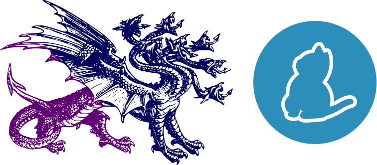

### Hi there 👋, I am Hasan

#### I am a Frontend Developer

- 🔭 I’m currently working on Frontend.
- 🌱 I’m currently learning Node JS
- 👯 I’m looking to collaborate on Opensource Projects
- 💬 Ask me about Javascript, Typescript and React
- 📫 How to reach me: hasanmobarak25@gmail.com

## My Skill Set

  
      
      
      
        
      
      
     
      
      
      
      
      
     
     
      
      
     
      
      
      
    
    

 

## Connect with me  

    
    
    
      
      

  
  

   

## Github Stats  

  

   
